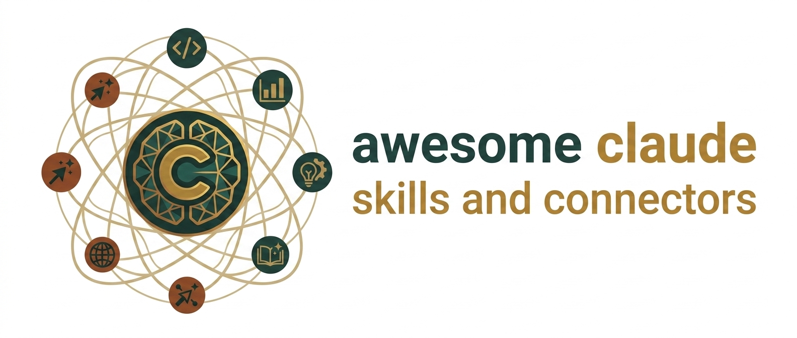

<p align="center">
  
</p>

<p align="center">
  
  
  
  
  
</p>

# Awesome Claude Skills and Connectors

A curated, categorized archive of 101 Claude Skills and 95 MCP connectors, organized by domain so you can find the right tool for the job instead of scrolling through one long list.

Browse it here as a table, or check out the **[interactive site](https://azyzhm.github.io/awesome-claude-skills-and-connectors/)** for search and filtering.

## Contents

- [What's the difference between a Skill and a Connector?](#whats-the-difference-between-a-skill-and-a-connector)
- [Skills](#skills)
  - [UX Design](#ux-design-skills)
  - [System Design](#system-design-skills)
  - [Engineering](#engineering-skills)
  - [Documentation](#documentation-skills)
  - [Automation](#automation-skills)
- [Connectors (MCP Servers)](#connectors-mcp-servers)
  - [UX Design](#ux-design-connectors)
  - [System Design](#system-design-connectors)
  - [Engineering](#engineering-connectors)
  - [Documentation](#documentation-connectors)
  - [Automation](#automation-connectors)
- [Installing a Skill](#installing-a-skill)
- [Contributing](#contributing)
- [Community](#community)

## What's the difference between a Skill and a Connector?

A **Skill** is a modular instruction package (a `SKILL.md` file plus optional scripts) that teaches Claude a domain-specific procedure, style, or checklist, no external connection required.

A **Connector** (MCP server) is a live integration that gives Claude a tool to actually reach outside the conversation: a database, a design canvas, a repo, a calendar.

Many workflows combine both, a skill teaches the *how*, a connector provides the *access*.

## Skills

### UX Design <a id="ux-design-skills"></a>

_Visual and interaction design, canvas tools, design tokens, icons, and brand systems._

| Skill | What it does | Source |
|---|---|---|
| [`accessibility-wcag-auditor`](https://github.com/alirezarezvani/claude-skills) | Audits frontend HTML/JSX for screen reader aria-attributes, focus traps, semantic markup, and WCAG 2.1 AAA compliance. | Claude Skills Library |
| [`brand-guidelines`](https://github.com/ComposioHQ/awesome-claude-skills) | Applies official brand colors, typographic hierarchy, logo margins, and corporate identity rules to generated artifacts. | Anthropic / Composio Skill |
| [`color-palette-generator`](https://github.com/ComposioHQ/awesome-claude-skills) | Algorithmic rules for generating accessible primary, secondary, functional, and semantic color scales. | Brand Build Library |
| [`component-library-builder`](https://github.com/alirezarezvani/claude-skills) | Enforces atomic design methodology (Atoms, Molecules, Organisms) for modular frontend code architecture. | Claude Skills Library |
| [`dark-mode-adapter`](https://github.com/alirezarezvani/claude-skills) | Provides systemic rules for mapping light-mode color variables to dark-mode equivalents without losing visual hierarchy. | Claude Skills Library |
| [`dashboard-layout-designer`](https://github.com/alirezarezvani/claude-skills) | Teaches layout patterns for complex enterprise dashboards, metric cards, sidebar navigations, and data grids. | Claude Skills Library |
| [`design-tokens-manager`](https://github.com/alirezarezvani/claude-skills) | Automates conversion of design tokens into Tailwind CSS configs, SCSS variables, and CSS custom properties. | Claude Skills Library |
| [`excalidraw-canvas-skill`](https://github.com/yctimlin/mcp_excalidraw) | Enables coding agents to draw, screenshot, auto-arrange, and iteratively refine .excalidraw diagram files. | Excalidraw Workbench |
| [`figjam-plan-generator`](https://github.com/figma/mcp-server-guide) | Formats product requirements and user journey mapping inputs into structured FigJam board creation steps. | Figma Official Skill |
| [`figma-generate-design`](https://github.com/figma/mcp-server-guide/blob/main/skills/figma-generate-design/SKILL.md) | Enforces a strict parallel workflow for resolving design tokens, component keys, and structural frames before mutating Figma canvases. | Figma Official Skill |
| [`figma-use`](https://github.com/figma/mcp-server-guide) | Core instruction prerequisite for Figma interaction: font loading, node hierarchy parsing, and color normalization. | Figma Official Skill |
| [`frontend-design`](https://github.com/anthropics/skills) | Instructs Claude to create distinctive, production-grade frontend components, avoiding generic layout templates and enforcing custom typography and spatial grids. | Anthropic Official Skill |
| [`iconography-guide`](https://github.com/alirezarezvani/claude-skills) | Establishes rules for consistent icon sizing, stroke weights, bounding boxes, and framework integration (Lucide, Heroicons). | Claude Skills Library |
| [`micro-interaction-animator`](https://github.com/alirezarezvani/claude-skills) | Guides Framer Motion and CSS keyframe animations for polished hover, press, and loading states. | Claude Skills Library |
| [`mobile-ui-designer`](https://github.com/alirezarezvani/claude-skills) | Focuses design logic on native mobile patterns (iOS HIG, Android Material 3), thumb zones, and bottom sheets. | Claude Skills Library |
| [`penpot-uiux-design`](https://lobehub.com/skills/github-awesome-copilot-penpot-uiux-design) | Teaches multi-step UI layout procedures, spacing rules, and WCAG AA contrast rules for Penpot visual designs. | Penpot / LobeHub Skill |
| [`responsive-grid-builder`](https://github.com/alirezarezvani/claude-skills) | Standardizes 12-column layout grids, flexbox alignment logic, and mobile-first breakpoint rules across viewports. | Claude Skills Library |
| [`svg-designer`](https://github.com/anthropics/skills) | Guides hand-crafted, vector-optimized SVG code with responsive viewBox parameters and CSS animation paths. | Anthropic Official Skill |
| [`tail-wind-styler`](https://github.com/alirezarezvani/claude-skills) | Teaches utility-first CSS strategies: responsive breakpoints, theme extension patterns, arbitrary value minimization. | Claude Skills Library |
| [`typography-scale-designer`](https://github.com/alirezarezvani/claude-skills) | Constructs modular typographic ratio scales (Major Third, Golden Ratio) and fluid responsive font sizing systems. | Claude Skills Library |
| [`ui-ux-reviewer`](https://github.com/alirezarezvani/claude-skills) | Evaluates existing application UI code against visual hierarchy guidelines, touch target dimensions, and interactive feedback states. | Claude Skills Library |
| [`user-flow-mapper`](https://github.com/alirezarezvani/claude-skills) | Transforms feature user stories into sequential step-by-step wireframe nodes and interface state charts. | Claude Skills Library |
| [`video-interaction-mapper`](https://github.com/figma/mcp-server-guide) | Analyzes UI interaction video frames and converts them into annotated Figma storyboard specs. | Figma Official Skill |
| [`web-design-engineer`](https://github.com/ConardLi/garden-skills/blob/main/skills/web-design-engineer/README.md) | Turns Claude into a senior UI/UX engineer skilled at responsive layouts, CSS grid systems, and modern component state management. | Garden Skills Package |

### System Design <a id="system-design-skills"></a>

_Architecture, databases, cloud infrastructure, IaC, and security._

| Skill | What it does | Source |
|---|---|---|
| [`api-design-reviewer`](https://github.com/borghei/Claude-Skills) | Audits REST and gRPC API designs for URL consistency, HTTP status code accuracy, pagination, and error payload structures. | Borghei Claude Skills |
| [`database-schema-architect`](https://github.com/alirezarezvani/claude-skills) | Guides third-normal-form relational schema design, index strategy selection, and foreign key constraint setups. | Claude Skills Library |
| [`design-system-architect`](https://github.com/alirezarezvani/claude-skills) | Standardizes the structure for W3C-compliant JSON design tokens, theme toggling logic, and multi-brand style dictionaries. | Claude Skills Library |
| [`dockerfile-optimizer`](https://github.com/alirezarezvani/claude-skills) | Multi-stage Dockerfile construction rules for minimal base images, ordered layer caching, and non-root execution. | Claude Skills Library |
| [`error-handling-patterns`](https://github.com/alirezarezvani/claude-skills) | Enforces uniform error classification, structured logging schemas, circuit breaker patterns, and graceful degradation. | Claude Skills Library |
| [`graphql-schema-designer`](https://github.com/alirezarezvani/claude-skills) | Enforces relay spec compliance, custom scalar validation, query complexity limits, and N+1 query prevention. | Claude Skills Library |
| [`kubernetes-manifest-generator`](https://github.com/alirezarezvani/claude-skills) | Generates compliant K8s Deployment, Service, Ingress, and ConfigMap YAMLs with strict resource request/limit definitions. | Claude Skills Library |
| [`microservices-architect`](https://github.com/alirezarezvani/claude-skills) | Outlines domain-driven design (DDD) boundaries, event-driven integration patterns, and distributed transaction strategies. | Claude Skills Library |
| [`terraform-module-builder`](https://github.com/alirezarezvani/claude-skills) | Standardizes HCL code organization, variable definitions, output mappings, and remote backend states for IaC modules. | Claude Skills Library |
| [`vault-secrets-manager`](https://github.com/alirezarezvani/claude-skills) | Teaches application secret handling using dynamic secret injection, HashiCorp Vault integrations, and rotation rules. | Claude Skills Library |

### Engineering <a id="engineering-skills"></a>

_Code quality, version control, testing, debugging, and sandboxed execution._

| Skill | What it does | Source |
|---|---|---|
| [`async-concurrency-guide`](https://github.com/alirezarezvani/claude-skills) | Prevents race conditions, deadlocks, and thread safety bugs in asynchronous code (asyncio, Promises, goroutines). | Claude Skills Library |
| [`ci-cd-pipeline-builder`](https://github.com/borghei/Claude-Skills) | Drafts optimized GitHub Actions workflows, GitLab CI YAMLs, caching layers, and security scanning jobs. | Borghei Claude Skills |
| [`code-review`](https://code.claude.com/docs/en/skills) | Automated reviewer checking diffs for edge-case bugs, security vulnerabilities, style violations, and test coverage. | Claude Code Bundled Skill |
| [`csv-data-cleaner`](https://github.com/alirezarezvani/claude-skills) | Multi-step data cleaning: handling missing values, parsing dates, deduplication, and format normalization. | Claude Skills Library |
| [`deep-learning-tutor`](https://github.com/alirezarezvani/claude-skills/blob/main/CLAUDE.md) | A companion skill that references deep learning textbook concepts, AdamW optimization deltas, and diagnostic paths. | Reusable Companion Skill |
| [`dependency-updater`](https://github.com/alirezarezvani/claude-skills) | Safe dependency upgrading workflow checking breaking release notes, semver risks, and audit alerts. | Claude Skills Library |
| [`e2e-playwright-tester`](https://github.com/anthropics/skills) | Directs writing end-to-end integration tests using Playwright with auto-waiting and selector strategies. | Anthropic Technical Skill |
| [`git-pushing`](https://github.com/ComposioHQ/awesome-claude-skills) | Automates git commit formatting, branch naming conventions, conflict checks, and PR creation workflows. | Awesome Claude Skills |
| [`go-cli-builder`](https://github.com/alirezarezvani/claude-skills) | Standardizes Go CLI application structure using Cobra, Viper configuration loading, and standard I/O pipelines. | Claude Skills Library |
| [`mcp-server-generator`](https://github.com/anthropics/skills) | Guides scaffolding and writing boilerplate code for new TypeScript/Python MCP servers. | Anthropic Technical Skill |
| [`performance-profiler`](https://github.com/alirezarezvani/claude-skills) | Guides performance bottleneck identification, memory leak diagnosis, CPU profiling interpretation, and optimization. | Claude Skills Library |
| [`python-clean-code`](https://github.com/alirezarezvani/claude-skills) | Enforces PEP 8 style, explicit type hint annotations, docstrings, and stdlib idioms across Python codebases. | Claude Skills Library |
| [`refactoring-expert`](https://github.com/alirezarezvani/claude-skills) | Applies Fowler's refactoring patterns to simplify complex code, reduce cyclomatic complexity, and extract reusable modules. | Claude Skills Library |
| [`review-implementing`](https://github.com/ComposioHQ/awesome-claude-skills) | Evaluates code implementation plans against technical specs before code is written, ensuring architectural alignment. | Awesome Claude Skills |
| [`rust-memory-safety`](https://github.com/alirezarezvani/claude-skills) | Guides Rust developers through ownership, borrowing, lifetime annotations, and safe wrapper encapsulation for unsafe code. | Claude Skills Library |
| [`security-audit-sast`](https://github.com/alirezarezvani/claude-skills) | Evaluates source code for OWASP Top 10 risks, SQL injection, hardcoded credentials, and unsafe deserialization. | Claude Skills Library |
| [`sql-query-optimizer`](https://github.com/alirezarezvani/claude-skills) | Explains SQL EXPLAIN ANALYZE outputs, recommending index additions, CTE refactoring, and query rewrite strategies. | Claude Skills Library |
| [`test-fixing`](https://github.com/ComposioHQ/awesome-claude-skills) | Analyzes failing test runner logs, identifies root assertion failures, and drafts targeted code patches. | Awesome Claude Skills |
| [`typescript-strict-migrator`](https://github.com/alirezarezvani/claude-skills) | Step-by-step strategies for migrating JavaScript projects to TypeScript with strict flag enablement. | Claude Skills Library |
| [`web-scraper-stealth`](https://github.com/alirezarezvani/claude-skills) | Instructions for writing clean web scraping scripts handling rate limiting, user-agent rotation, and DOM parsing. | Claude Skills Library |

### Documentation <a id="documentation-skills"></a>

_Writing, diagramming, and knowledge management._

| Skill | What it does | Source |
|---|---|---|
| [`api-documentation-writer`](https://github.com/alirezarezvani/claude-skills) | Converts API route code and schemas into human-readable Markdown documentation with curl examples. | Claude Skills Library |
| [`architecture-decision-records`](https://github.com/alirezarezvani/claude-skills) | Templates and rules for writing clear ADRs (Architecture Decision Records) using MADR format. | Claude Skills Library |
| [`book-to-skill-companion`](https://github.com/alirezarezvani/claude-skills/blob/main/CLAUDE.md) | Framework for indexing technical books or external manuals into structured, token-conscious reference skills. | Reusable Meta-Skill |
| [`changelog-generator`](https://github.com/borghei/Claude-Skills) | Analyzes Git commit logs and PR titles to draft structured, conventional-changelog formatted release notes. | Borghei Claude Skills |
| [`codebase-onboarding`](https://github.com/borghei/Claude-Skills/blob/main/engineering/codebase-onboarding/SKILL.md) | Scans target repos to build architecture overviews, annotated file maps, setup steps, and developer runbooks. | Borghei Claude Skills |
| [`data-dictionary-builder`](https://github.com/alirezarezvani/claude-skills) | Converts raw SQL schemas and data warehouse tables into annotated business data dictionaries with lineage notes. | Claude Skills Library |
| [`dev-setup-guide-author`](https://github.com/alirezarezvani/claude-skills) | Generates copy-paste verified local environment setup steps, missing dependency checks, env variable descriptions. | Claude Skills Library |
| [`docx-document-editor`](https://github.com/anthropics/skills) | Guidelines for programmatic docx document generation, styling, table formatting, and layout. | Anthropic Document Skill |
| [`humanizer`](https://github.com/blader/humanizer) | Rewrites AI-sounding text to read like a person wrote it, without changing what it says. Checks a draft against 35 patterns from Wikipedia's Signs of AI Writing, such as inflated claims, sales language, em dashes, and chatbot leftovers, then produces a cleaned-up final version. | Community Skill (blader) |
| [`internal-comms-writer`](https://github.com/ComposioHQ/awesome-claude-skills) | Helps draft company newsletters, status updates, 3P reports (Progress, Plans, Problems), and executive FAQs. | Business Operations |
| [`knowledge-ops`](https://github.com/ComposioHQ/awesome-claude-skills) | Establishes rules for organizing corporate knowledge bases, taxonomy tagging, and deduplicating wiki pages. | Business Operations |
| [`mermaid-diagram-author`](https://github.com/alirezarezvani/claude-skills) | Teaches syntax rules for Mermaid flowcharts, sequence diagrams, ER diagrams, and state diagrams. | Claude Skills Library |
| [`outline-wiki-manager`](https://github.com/ComposioHQ/awesome-claude-skills) | Instructions for querying, structuring, and formatting documentation pages inside Outline wiki instances. | Awesome Claude Skills |
| [`pdf-processing-guide`](https://github.com/anthropics/skills) | Exact Python recipes (pypdf, pdfplumber) for reading, extracting form fields, and editing PDF files. | Anthropic Document Skill |
| [`post-mortem-writer`](https://github.com/alirezarezvani/claude-skills) | Standardized blameless incident post-mortem template covering timeline creation, root cause analysis (5 Whys), action items. | Claude Skills Library |
| [`pptx-presentation-builder`](https://github.com/anthropics/skills) | Rules for generating PowerPoint files using python-pptx: slide layout structures, brand themes, visual hierarchy. | Anthropic Document Skill |
| [`process-mapper`](https://github.com/ComposioHQ/awesome-claude-skills) | Translates operational business processes into standardized Business Process Model and Notation (BPMN) diagrams. | Business Operations |
| [`prompt-master`](https://github.com/ComposioHQ/awesome-claude-skills) | Assists in drafting highly accurate system prompts for various LLM tools without wasting context. | Prompt Master Skill |
| [`readme-craftsman`](https://github.com/alirezarezvani/claude-skills) | Formats GitHub repository README files with badges, architecture diagrams, installation instructions, and contribution guides. | Claude Skills Library |
| [`release-notes-summarizer`](https://github.com/alirezarezvani/claude-skills) | Distills complex multi-repository PRs into non-technical customer-facing product release announcements. | Claude Skills Library |
| [`runbook-generator`](https://github.com/alirezarezvani/claude-skills) | Formats operational troubleshooting runbooks with step-by-step diagnostic commands and rollback triggers. | Claude Skills Library |
| [`swagger-openapi-docs`](https://github.com/alirezarezvani/claude-skills) | Converts plain text or code annotations into OpenAPI 3.1 specification YAML files with complete schema definitions. | Claude Skills Library |
| [`sysadmin-cheatsheet-builder`](https://github.com/alirezarezvani/claude-skills) | Builds custom command-line cheat sheets for sysadmins, categorized by operational task and safety level. | Claude Skills Library |
| [`technical-spec-writer`](https://github.com/alirezarezvani/claude-skills) | Guides drafting RFCs and Technical Product Requirement Documents (PRDs) for PMs and senior engineers. | Claude Skills Library |
| [`user-manual-creator`](https://github.com/alirezarezvani/claude-skills) | Guides creation of end-user feature documentation, complete with step-by-step walkthroughs and visual callouts. | Claude Skills Library |
| [`xlsx-spreadsheet-manager`](https://github.com/anthropics/skills) | Guidelines for constructing openpyxl spreadsheet workbooks, calculated formulas, data tables, and chart objects. | Anthropic Document Skill |

### Automation <a id="automation-skills"></a>

_Workflow orchestration, scheduling, browsing, and operational tooling._

| Skill | What it does | Source |
|---|---|---|
| [`batch-file-renamer`](https://github.com/alirezarezvani/claude-skills) | Safe file system operation instructions for batch renaming workspace files using regex patterns with dry-run verification. | Claude Skills Library |
| [`capacity-planner`](https://github.com/ComposioHQ/awesome-claude-skills) | Teaches Claude to calculate engineering sprint velocity, resource allocation limits, and project delivery timelines. | Business Operations |
| [`competitive-ads-extractor`](https://github.com/ComposioHQ/awesome-claude-skills) | Guides extracting, categorizing, and analyzing competitors' ad creative strategies. | Awesome Claude Skills |
| [`cron-job-scheduler-guide`](https://github.com/alirezarezvani/claude-skills) | Converts natural language recurring schedules into valid cron expressions with timezone handling. | Claude Skills Library |
| [`deal-desk-orchestrator`](https://github.com/ComposioHQ/awesome-claude-skills) | Automates enterprise sales deal review, discounting authorization logic, and custom contract term approvals. | Commercial & Finance |
| [`domain-name-brainstormer`](https://github.com/ComposioHQ/awesome-claude-skills) | Generates creative domain names based on brand constraints and checks TLD availability patterns. | Awesome Claude Skills |
| [`github-workflow-automation`](https://claudecowork.im/resources/github) | Instruction set for managing repository issues, reviewing PRs, and running GitHub Actions workflows from Claude Code. | Official Plugin Skill |
| [`google-workspace-automation`](https://github.com/ComposioHQ/awesome-claude-skills) | Cheatsheet rules for executing complex multi-product actions across Google Docs, Sheets, Calendar, and Drive. | Awesome Claude Skills |
| [`incident-triage-runbook`](https://github.com/alirezarezvani/claude-skills) | Rules for triaging incoming production errors, determining severity levels (P1-P4), and routing on-call alerts. | Claude Skills Library |
| [`jira-sprint-planner`](https://github.com/alirezarezvani/claude-skills) | Converts user story maps into formatted Jira issue backlogs with acceptance criteria, story points, and epics. | Claude Skills Library |
| [`mercury-agent-orchestrator`](https://github.com/ComposioHQ/awesome-claude-skills) | Multi-agent coordination instructions for messaging agent teammates, managing threads, and scheduling background jobs. | Mercury Agent Skill |
| [`nightly-sleep-cycle-opt`](https://github.com/alirezarezvani/claude-skills/blob/main/CLAUDE.md) | Automated session harvest skill that mines daily coding session transcripts for recurring tasks and updates skills. | Skill Optimization |
| [`planning-with-files`](https://github.com/alirezarezvani/claude-skills) | Persistent file-based planning for coding agents; creates crash-proof markdown plans and prevents context rot over long tasks. | Planning Framework |
| [`pricing-strategist`](https://github.com/ComposioHQ/awesome-claude-skills) | Analyzes product tiering, unit economics, value metric pricing models, and SaaS monetization strategies. | Commercial & Finance |
| [`procurement-optimizer`](https://github.com/ComposioHQ/awesome-claude-skills) | Standardizes software and hardware purchasing workflows, competitive bidding evaluations, and compliance gates. | Business Operations |
| [`seo-audit-suite`](https://github.com/ComposioHQ/awesome-claude-skills) | An SEO diagnostic workflow covering meta tags, canonical link verification, header structure, and site crawl analysis. | RampStack Skill Library |
| [`skill-creator`](https://github.com/ComposioHQ/awesome-claude-skills/blob/master/skill-creator/SKILL.md) | Meta-skill providing a complete workflow and template for creating, testing, and packaging new Claude SKILL.md packages. | Anthropic / Composio Skill |
| [`slack-bot-notifier`](https://github.com/alirezarezvani/claude-skills) | Formats block-kit JSON payloads for automated Slack alerts, deployment notifications, and incident updates. | Claude Skills Library |
| [`vendor-management`](https://github.com/ComposioHQ/awesome-claude-skills) | Framework for analyzing vendor proposals, evaluating SLAs, calculating TCO, and tracking contract renewals. | Business Operations |
| [`verify-workflow`](https://code.claude.com/docs/en/skills) | Runs project builds and test suites, records successful execution steps into .claude/skills/verify/SKILL.md for future agents. | Claude Code Bundled Skill |
| [`workflow-orchestrator`](https://github.com/alirezarezvani/claude-skills) | General-purpose task decomposition skill that breaks complex user goals into explicit sequential execution pipelines. | Claude Skills Library |

## Connectors (MCP Servers)

### UX Design <a id="ux-design-connectors"></a>

| Connector | What it does | Transport |
|---|---|---|
| [Better Icons MCP](https://github.com/better-auth/better-icons) | Multi-framework icon bridge supporting project synchronization, smart batching, and usage auto-learning. | Stdio / npx |
| [Blender MCP Server](https://www.bezi.com/blog/introducing-mcps) | Exposes 3D scene hierarchies, mesh data, object manipulation, and material configurations via Blender's Python API. | Stdio / Python |
| [Excalidraw MCP App](https://github.com/excalidraw/excalidraw-mcp) | Interactive visual diagramming application streaming hand-drawn visual sketches and UI wireframes directly in chat. | HTTP / Remote |
| [Excalidraw Workbench Server](https://github.com/yctimlin/mcp_excalidraw) | Persistent canvas toolkit enabling AI agents to programmatically build, screenshot, layout, and export .excalidraw files. | Stdio / CLI |
| [Figma Dev Mode Local MCP](https://github.com/topics/figma-mcp) | Local alternative to Dev Mode with zero rate limits, enabling local token extraction and verification loops. | Stdio / Local |
| [Figma Official MCP](https://github.com/mcp/com.figma.mcp/mcp) | Canvas reading, code extraction via Code Connect, variable extraction, auto-layout parsing, and native element writing. | HTTP / Remote |
| [Figma Tailwind Cookiecutter](https://github.com/topics/figma-mcp) | Synchronizes visual tokens from Figma directly into Tailwind CSS configuration presets. | Stdio / Node |
| [Forge Space Branding MCP](https://github.com/forge-space/branding-mcp) | Algorithmic brand identity system generating WCAG-compliant color harmonies, modular type scales, and motion tokens. | Stdio / npx |
| [Handoff Figma-to-React MCP](https://github.com/panktishah62/MCP-Stack-for-UI-UX-Designers) | Converts structural Figma frames into responsive React components styled with utility-first Tailwind CSS. | Stdio / Node |
| [Iconify SVG API Server](https://explainx.ai/mcp-servers/iconify-svg) | Lightweight icon finder allowing description-based search and direct SVG string injection into code templates. | Stdio / Node |
| [Iconify Vector MCP](https://github.com/imjac0b/iconify-mcp-server) | Vector icon search and generation providing access to over 200,000 open-source icons across 200+ collections. | Stdio / Node |
| [Inspire Web UI Scraping MCP](https://github.com/panktishah62/MCP-Stack-for-UI-UX-Designers) | Captures complete HTML/CSS structure from live target websites to analyze visual design patterns and UI components. | Stdio / Node |
| [OpenPencil AI Design Editor](https://github.com/open-pencil/open-pencil) | Programmatic design editor supporting native .fig and .pen file editing via headless Vue SDK and XPath queries. | Stdio / Native |
| [Penpot Official MCP](https://github.com/penpot/penpot-mcp) | Open-source vector design server allowing scriptable plugin execution, canvas modifications, and SVG export. | WebSocket / HTTP |
| [Pickapicon SVG MCP](https://github.com/leee62/pickapicon-mcp) | High-speed SVG retrieval engine connecting Claude to the Iconify API for immediate UI asset integration. | Stdio / Node |
| [Storybook Components MCP](https://mcpservers.org/) | Connects Claude to live Storybook documentation, analyzing component props, variant controls, and rendered DOMs. | Stdio / Playwright |
| [Storybook Design Token Addon](https://github.com/UX-and-I/storybook-design-token) | Parses stylesheets and icon assets to render live design token documentation panels directly in Storybook. | Node / Addon |
| [TellFigma Canvas MCP](https://github.com/topics/code-to-design) | Real-time design canvas writing and editing directly from terminal CLI environments via WebSocket bridge. | WebSocket / Stdio |
| [theSVG Brand Icon Repository](https://github.com/glincker/thesvg) | Specialized server providing immediate access to over 6,500 brand and cloud platform vector logos. | HTTP / REST |

### System Design <a id="system-design-connectors"></a>

| Connector | What it does | Transport |
|---|---|---|
| [AWS Infrastructure MCP](https://github.com/awslabs/mcp) | AWS service documentation lookup, billing analysis, CDK synthesis, and cloud resource metadata inspection. | Stdio / Python |
| [AWS KB Bedrock Retrieval](https://github.com/modelcontextprotocol/servers) | Direct vector lookup and knowledge retrieval against custom enterprise AWS Bedrock Knowledge Bases. | Stdio / Python |
| [Bytebase DBHub Multi-DB](https://github.com/bytebase/dbhub) | Token-conscious single MCP server managing schema inspection and query execution across Postgres, MySQL, and SQL Server. | Stdio / Go |
| [Cloudflare Developer Platform](https://mcpservers.org/) | Deploy, configure, and interrogate Workers, KV stores, R2 storage, and D1 relational databases. | HTTP / Remote |
| [Design System Token MCP](https://github.com/yajihum/design-system-mcp) | Extracts, validates, and builds W3C design tokens from JSON definitions into CSS variables and JS modules. | Stdio / Deno |
| [Docker Container Stack MCP](https://github.com/appcypher/awesome-mcp-servers) | Container management, multi-container compose orchestration, log streaming, and volume inspection. | Stdio / Node |
| [HashiCorp Terraform MCP](https://www.pomerium.com/blog/best-model-context-protocol-mcp-servers-in-2025) | Structured inspection of official Terraform providers, module registry metadata, and HCL code validation. | Stdio / Go |
| [Keboola Data Operations](https://github.com/appcypher/awesome-mcp-servers) | Unifies enterprise ETL/ELT pipelines, automates data transformations, and orchestrates cloud storage sync. | Stdio / Node |
| [Keycloak Identity Manager](https://github.com/appcypher/awesome-mcp-servers) | Natural language administration of user accounts, group memberships, client applications, and realm configurations. | Stdio / Node |
| [Microsoft Entra ID MCP](https://github.com/appcypher/awesome-mcp-servers) | Advanced Graph API querying for tenant users, MFA compliance status, sign-in audit logs, and privileged access. | Stdio / C# |
| [MongoDB & Atlas MCP](https://github.com/appcypher/awesome-mcp-servers) | Natural language document querying, aggregation pipeline construction, and index optimization for MongoDB. | Stdio / Node |
| [Neon Serverless Postgres](https://github.com/appcypher/awesome-mcp-servers) | Natural language management of serverless Postgres instances, point-in-time recovery, and database branching. | Stdio / Node |
| [Netwrix Access Analyzer](https://github.com/appcypher/awesome-mcp-servers) | FastMCP security server analyzing identity access governance, permissions inheritance, and data exposure risks. | Stdio / Python |
| [OSV Vulnerability Database](https://github.com/appcypher/awesome-mcp-servers) | Queries Open Source Vulnerabilities database by package version, commit hash, or ecosystem vulnerability ID. | Stdio / Go |
| [PostgreSQL Read-Only MCP](https://github.com/modelcontextprotocol/servers) | Schema inspection, SQL query execution, table relationship analysis, and business intelligence querying. | Stdio / npx |
| [Qdrant Vector Engine MCP](https://github.com/appcypher/awesome-mcp-servers) | Persistent memory storage, payload filtering, vector search execution, and semantic index administration. | Stdio / Python |
| [Railway Infrastructure MCP](https://mcpservers.org/) | Environment variables pull/push, project deployment management, service health checks, and cloud logs. | HTTP / Remote |
| [Redis Key-Value MCP](https://github.com/modelcontextprotocol/servers) | Command execution, key space inspection, caching layer management, and pub/sub message inspection. | Stdio / Node |
| [SQLite MCP](https://github.com/modelcontextprotocol/servers) | Lightweight database querying, schema structure extraction, and transactional data analysis. | Stdio / uvx |
| [Semgrep Vulnerability Scanner](https://github.com/appcypher/awesome-mcp-servers) | Static code analysis scanning for security vulnerabilities, OWASP Top 10 bugs, and custom rule violations. | Stdio / Python |
| [Sentry Telemetry MCP](https://www.pomerium.com/blog/best-model-context-protocol-mcp-servers-in-2025) | Application issue extraction, exception stack trace analysis, alert management, and release tracking. | Stdio / Python |
| [StarRocks Analytics Engine](https://www.pomerium.com/blog/best-model-context-protocol-mcp-servers-in-2025) | High-performance SQL query interface optimized for large-scale enterprise data warehousing and analytics. | Stdio / Java |
| [Supabase Cloud MCP](https://mcpservers.org/) | Backend management covering database migrations, edge functions, storage buckets, and Auth rules. | HTTP / Remote |
| [Thales CipherTrust Suite](https://github.com/appcypher/awesome-mcp-servers) | Enterprise cryptographic key management, secret rotation, and data protection across enterprise applications. | Stdio / REST |
| [Vantage Cloud Cost Analytics](https://www.pomerium.com/blog/best-model-context-protocol-mcp-servers-in-2025) | FinOps cloud visibility analyzing infrastructure cost trends, cross-cloud spend patterns, and waste reduction. | Stdio / Go |
| [Vulert Dependency Security](https://github.com/appcypher/awesome-mcp-servers) | Real-time open-source dependency auditing without uploading full source code manifests or binaries. | Stdio / Node |
| [dbt Semantic Layer MCP](https://www.pomerium.com/blog/best-model-context-protocol-mcp-servers-in-2025) | Exposes project dependency graphs, semantic metrics, data model definitions, and CLI execution. | Stdio / Python |

### Engineering <a id="engineering-connectors"></a>

| Connector | What it does | Transport |
|---|---|---|
| [Chrome DevTools MCP](https://mcpservers.org/) | Live inspection, console error log monitoring, network request capture, and DOM element evaluation via coding agents. | HTTP / Remote |
| [E2B Cloud Sandbox MCP](https://github.com/appcypher/awesome-mcp-servers) | Secure, isolated cloud container runtime for running untrusted code snippets and data analysis routines. | Stdio / Node |
| [Git Repository MCP](https://github.com/modelcontextprotocol/servers) | Direct local Git operations including commit history inspection, branch creation, diffing, and stash management. | Stdio / uvx |
| [GitHub MCP (Mazedur1056)](https://lobehub.com/fr/mcp/mazedur1056-github-mcp-server) | Custom GitHub bridge connecting Claude and Cursor environments for issue and PR management. | Stdio / Node |
| [GitHub Official MCP](https://github.com/modelcontextprotocol/servers) | Repository manipulation, issue tracking, pull request management, code search, and GitHub Actions control. | Stdio / Node |
| [GitHub Repo Server (LogLMHQ)](https://mcpservers.org/servers/loglmhq/mcp-server-github-repo) | Lightweight MCP server specifically tuned for scanning GitHub repository contents and structural layouts. | HTTP / Remote |
| [GitLab API MCP](https://github.com/modelcontextprotocol/servers) | Project management, merge request review, issue management, and pipeline status querying within GitLab instances. | Stdio / Node |
| [MCP Everything Reference](https://github.com/mctrinh/awesome-mcp-servers) | A reference implementation bundling prompts, resources, and tools into a single test harness. | Stdio / Node |
| [MCP Inspector Visual Debugger](https://github.com/modelcontextprotocol) | Visual developer testing harness for inspecting, debugging, and testing tool calls across custom MCP servers. | Stdio / Node |
| [Microsandbox Executable](https://github.com/appcypher/awesome-mcp-servers) | Self-hosted, lightweight code execution platform providing local agent sandboxing for secure code execution. | Stdio / Node |
| [Proxyman Network Debugging](https://mcpservers.org/) | Allows Claude to inspect HTTP/HTTPS network traffic, analyze payload headers, and create mock debugging rules. | HTTP / Remote |
| [iOS/macOS Xcode Tooling](https://mcpservers.org/) | Command-line tool and agent environment for building, running tests, and inspecting Swift/Objective-C projects. | Stdio / Swift |

### Documentation <a id="documentation-connectors"></a>

| Connector | What it does | Transport |
|---|---|---|
| [Atlassian Confluence Base](https://mcpservers.org/) | Connects Claude to corporate Confluence spaces, searching pages, specs, and meeting documentation. | HTTP / Remote |
| [Brave Web & Local Search](https://github.com/modelcontextprotocol/servers) | Official web search integration allowing Claude to search the public web and local directories securely. | Stdio / Node |
| [Claude Mermaid Exporter](https://github.com/veelenga/claude-mermaid) | Saves generated diagram files directly into specified workspace paths, facilitating automated documentation builds. | Stdio / Node |
| [Context7 Documentation MCP](https://mcpservers.org/) | Fetches version-specific library documentation and code examples directly into AI prompts to prevent API hallucinations. | HTTP / Remote |
| [Diagrams MCP (PlantUML)](https://github.com/ByteOverDev/diagrams-mcp) | Unified rendering engine executing both Mermaid and PlantUML definition files into static visual artifacts. | Stdio / Python |
| [Exa Neural Search Engine](https://mcpservers.org/) | Specialized search engine optimized for AI agents, retrieving clean, semantically relevant web content. | HTTP / Remote |
| [Fetch Web Page Converter](https://github.com/modelcontextprotocol/servers) | Retrieves web pages and converts raw HTML into clean, token-efficient Markdown representations. | Stdio / uvx |
| [Google Drive File Access](https://github.com/modelcontextprotocol/servers) | Authorizes Claude to search, read, and process Google Docs, spreadsheets, and drive document trees. | Stdio / Python |
| [Google Search Console MCP](https://mcpservers.org/) | Connects to Google Search Console to analyze website performance, organic query metrics, and indexation status. | HTTP / Remote |
| [Granola Meeting Notes MCP](https://mcpservers.org/) | Directly queries Granola meeting transcripts, notes, and audio summaries to pull out operational decisions. | HTTP / Remote |
| [Hustcc Mermaid & Chart MCP](https://github.com/hustcc/mcp-mermaid) | Dynamic rendering engine converting structured data into visual Mermaid flowcharts, charts, and spatial maps. | Stdio / Node |
| [Interactive Mermaid Viewer](https://github.com/finfin/mermaid-mcp-app) | MCP App rendering Mermaid diagrams within an interactive viewer featuring pan, zoom, and live editor panels. | HTTP / Remote |
| [Internet Archive Open Library](https://github.com/appcypher/awesome-mcp-servers) | Enables searches against millions of cataloged books, historical texts, and author bibliographies. | Stdio / Python |
| [LLM-Context Extractor](https://github.com/appcypher/awesome-mcp-servers) | Packs repository code and file structures into structured context blocks for clipboard or API consumption. | Stdio / Rust |
| [MCP Mermaid Visual Intel](https://lobehub.com/mcp/kayaozkur-mcp-server-mermaid) | Visual diagram generation, validation, structural analysis, and SVG rendering platform. | Stdio / Node |
| [Memory Knowledge Graph](https://github.com/modelcontextprotocol/servers) | Persistent knowledge graph storing entities, relations, and qualitative insights across Claude operational sessions. | Stdio / npx |
| [Mermaid AI Workflow MCP](https://mermaid.ai/docs/ai/mcp-server) | Official Mermaid diagram generation tool assisting in flowcharts, sequence diagrams, and visual system maps. | Stdio / Node |
| [Mermaid Rendering Engine](https://github.com/mermaid-js/mermaid) | Converts Mermaid text definitions into high-resolution PNG or SVG vector files for local inline presentation. | Stdio / Node |
| [Next.js DevTools MCP](https://mcpservers.org/) | Provides Next.js development utilities, build debugging diagnostics, and server component context to Claude. | HTTP / Remote |
| [NotebookLM CLI Integration](https://mcpservers.org/) | Connects CLI agents to NotebookLM notebooks for zero-hallucination document-grounded question answering. | HTTP / Remote |
| [Repo Architecture Mermaid](https://github.com/peng-shawn/mermaid-mcp-server) | Automatically scans local or remote Git repositories to visualize package structures and dependency trees. | Stdio / Node |

### Automation <a id="automation-connectors"></a>

| Connector | What it does | Transport |
|---|---|---|
| [Alpha Vantage Market Analytics](https://mcpservers.org/) | Financial market data lookup, real-time stock quotes, historical ticker trends, and economic indicator queries. | HTTP / Remote |
| [Atlassian Jira Automation](https://mcpservers.org/) | Triage incoming issues, generate backlog tasks, transition workflow statuses, and update ticket details. | HTTP / Remote |
| [BaseBounty On-Chain Escrow](https://mcpservers.org/) | Autonomous agent job execution platform taking paid jobs and processing USDC payments via ERC-8183 escrow. | HTTP / Remote |
| [Cal.com Scheduling MCP](https://mcpservers.org/) | Queries calendar availability, books appointment slots, and manages booking cancellations automatically. | HTTP / Remote |
| [Ego Lite Fast Browser](https://mcpservers.org/) | High-speed browser automation engine sharing pre-authenticated state with coding agents at zero compute cost. | HTTP / Remote |
| [EverArt AI Image Gen](https://github.com/modelcontextprotocol/servers) | Generates visual assets and marketing imagery using customizable, multi-model AI image generation endpoints. | Stdio / Node |
| [Fast Filesystem Extended](https://github.com/appcypher/awesome-mcp-servers) | Optimized filesystem server featuring large file chunking, structural searches, and fast file transformations. | Stdio / Rust |
| [Filesystem Secure I/O](https://github.com/modelcontextprotocol/servers) | Secure local file operations enforcing strict directory path permissions and file manipulation access controls. | Stdio / npx |
| [Google Maps Geospatial](https://github.com/modelcontextprotocol/servers) | Location geocoding, distance calculation, place detailing, and routing direction generation via Google Maps API. | Stdio / Node |
| [MiniMax Media Generation](https://mcpservers.org/) | Connects Claude to MiniMax APIs for high-quality text-to-speech rendering, image generation, and video synthesis. | HTTP / Remote |
| [Opsgenie Incident Manager](https://mcpservers.org/) | Triage operational alerts, query on-call schedules, escalate system outages, and post post-mortem notes. | HTTP / Remote |
| [Playwright MCP](https://www.pomerium.com/blog/best-model-context-protocol-mcp-servers-in-2025) | Headless browser automation executing web navigation, form interaction, visual assertions, and page scraping. | Stdio / Node |
| [Puppeteer Scraping MCP](https://github.com/modelcontextprotocol/servers) | Browser automation engine for web crawling, DOM extraction, PDF printing, and dynamic page rendering. | Stdio / Node |
| [Sequential Thinking Server](https://github.com/modelcontextprotocol/servers) | Structured reflective reasoning server enabling dynamic, step-by-step problem-solving and plan adjustments. | Stdio / npx |
| [Slack Team Communication](https://github.com/modelcontextprotocol/servers) | Channel listing, thread reading, message posting, and automated team alerting within Slack workspaces. | Stdio / Node |
| [Time & Timezone Conversion](https://github.com/modelcontextprotocol/servers) | Local system time lookup, epoch timestamp calculation, and cross-timezone scheduling conversions. | Stdio / uvx |

## Installing a Skill

- **Claude Code (CLI):** place the skill folder in `~/.claude/skills/` (global) or `.claude/skills/` (project-level), or install via the plugin marketplace with `/plugin marketplace add <repo>`.
- **Claude Desktop / Claude.ai:** upload the skill zip or folder containing `SKILL.md` in the custom skills settings panel.
- **Cursor / Codex / Gemini CLI:** copy the skill folder into `~/.codex/skills/`, `~/.cursor/skills/`, or use the `agent-skills-cli` installer.

Two rules that trip people up: the instruction file must be named exactly `SKILL.md` (uppercase, lowercase silently fails on some engines), and folder names must be lowercase with hyphens (e.g. `frontend-design`).

## Contributing

Found a skill or connector that should be here? See [CONTRIBUTING.md](CONTRIBUTING.md) for the full guide. Short version: add an entry to `data/skills.json` or `data/connectors.json`, then run:

```bash
scripts/build_all.sh
```

This keeps the README and the website in sync from a single source of truth.

## Community

- [Code of Conduct](CODE_OF_CONDUCT.md), the standards this project holds contributors to
- [Security Policy](SECURITY.md), how to report a suspicious or deprecated listing, or a vulnerability in this repo's own code
- [License](LICENSE), MIT for this repo's own code and content. Each listed skill or connector keeps its own license, check the source before installing one